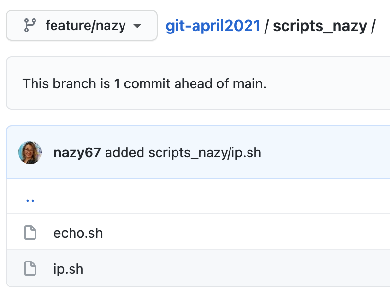

Homework:

- [x] 1. Create a feature branch off of dev branch.
- [x] 2. Add the code from your scripting to your folder "git_april2021"
- [x] 3. Push the code to your feature branch.
- [x] 4. Create a pull request feature to dev.
- [x] 5. Request a review from your class mates on your PR.
- [ ] 6. Please review/comment/approve your class mates PRs.

`git branch` - is the first command we need to run, to check which branch we are on and output from it will look like this:

```
* main
```

`git fetch origin dev` -  will fetch a dev branch from a remote repository to local repository output should be this,

```
From github.com:aKumoSolutions/git-april2021
\* branch            dev        -> FETCH_HEAD

```

`git checkout dev` - will checkout to dev branch with this output:

```
Branch dev set up to track remote branch dev from origin.
Switched to a new branch 'dev'
```

Just to be on safe side we can run  `git branch` again and outputs should be next:

```
* dev
 main
```
 
`git rebase origin` - I ran this command because, in dev branch I was missing a script_zhanar, and output will look like this when you sync remote repository with local. 

```
First, rewinding head to replay your work on top of it...
Fast-forwarded dev to origin.
```

Next I created a feature/nazy branch, and switched to it,

```
git branch feature/nazy
git checkout feature/nazy
```

Output from that command:

```
Switched to branch 'feature/nazy'
```

And again checking the branch which we are working on with `git branch`, and output is the next,

```
  dev
* feature/nazy
  main
```

Added ip.sh to scripts_nazy on local feature/nazy branch


Pushed my feature/nazy branch to remote git-april2021 repository,

```
git push -u origin feature/nazy
```


After that pushed the ip.sh to remote feature/nazy branch,

```
git add scripts_nazy/ip.sh
git commit -m "added scripts_nazy/ip.sh"
git push -u origin feature/nazy
```



Created pull request (PR) form feature/nazy to dev,


